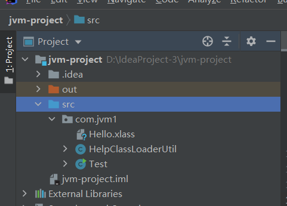
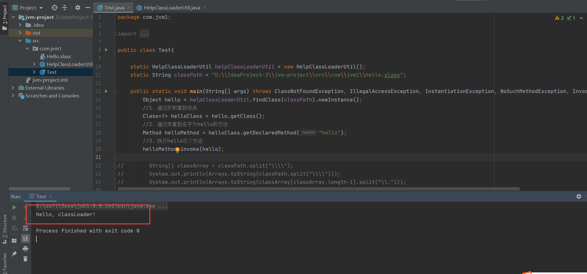
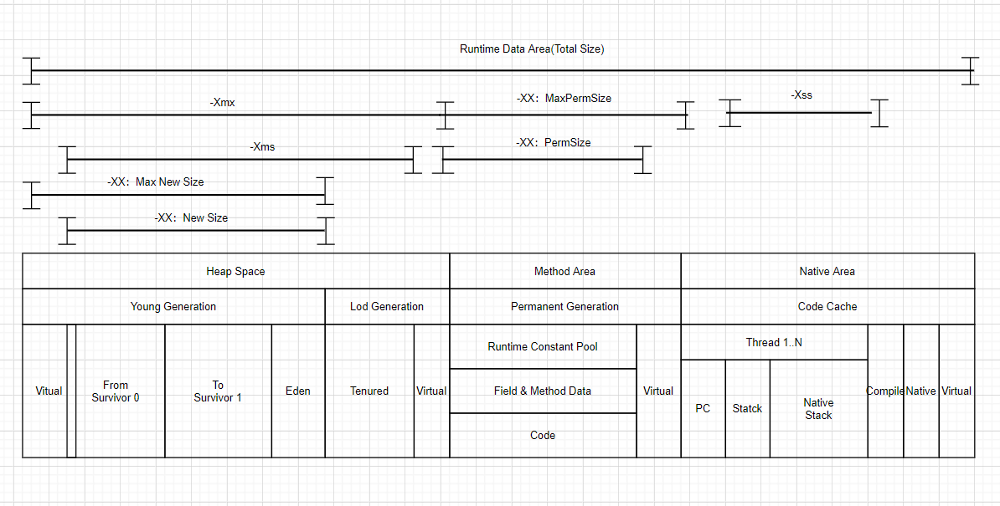

# work1

**Week01 作业题目（周四）：**

**1.（选做）**自己写一个简单的 Hello.java，里面需要涉及基本类型，四则运行，if 和 for，然后自己分析一下对应的字节码，有问题群里讨论。

**2.（必做）**自定义一个 Classloader，加载一个 Hello.xlass 文件，执行 hello 方法，此文件内容是一个 Hello.class 文件所有字节（x=255-x）处理后的文件。文件群里提供。

**3.（必做）**画一张图，展示 Xmx、Xms、Xmn、Meta、DirectMemory、Xss 这些内存参数的关系。

**4.（选做）**检查一下自己维护的业务系统的 JVM 参数配置，用 jstat 和 jstack、jmap 查看一下详情，并且自己独立分析一下大概情况，思考有没有不合理的地方，如何改进。

**注意：**如果没有线上系统，可以自己 run 一个 web/java 项目。

**Week01 作业题目（周六）：**

**1.（选做）**本机使用 G1 GC 启动一个程序，仿照课上案例分析一下 JVM 情况。

以上作业，要求 2 道必做题目提交到 github 上面，Week01 作业提交地址：[ https://github.com/JAVA-000/JAVA-000/issues/3](https://github.com/JAVA-000/JAVA-000/issues/3)

请务必按照示例格式进行提交，不要复制其他同学的格式，以免格式错误无法抓取作业。
作业提交截止时间 10 月 21 日（下周三）23:59 前。

Github 使用教程：[ https://u.geekbang.org/lesson/51?article=294701](https://u.geekbang.org/lesson/51?article=294701)

学号查询方式：PC 端登录 time.geekbang.org, 点击右上角头像进入我的教室，左侧头像下方 G 开头的为学号


＃学号：G20200343150050
＃姓名：郑晖
＃班级：网络171C
＃作业链接：https://github.com/8042965/JAVA-000/blob/main/Week_01


# 作业

## 第一题

**1.（选做）**自己写一个简单的 Hello.java，里面需要涉及基本类型，四则运行，if 和 for，然后自己分析一下对应的字节码，有问题群里讨论。

待补充


## 第二题

**2.（必做）**自定义一个 Classloader，加载一个 Hello.xlass 文件，执行 hello 方法，此文件内容是一个 Hello.class 文件所有字节（x=255-x）处理后的文件。文件群里提供。


**项目目录结构：**




**执行结果：**




**Test.java文件**

```java
package com.jvm1;

import java.io.*;
import java.lang.reflect.InvocationTargetException;
import java.lang.reflect.Method;
import java.util.Arrays;

public class Test{

    static HelpClassLoaderUtil helpClassLoaderUtil = new HelpClassLoaderUtil();
    static String classPath = "D:\\IdeaProject-3\\jvm-project\\src\\com\\jvm1\\Hello.xlass";

    public static void main(String[] args) throws ClassNotFoundException, IllegalAccessException, InstantiationException, NoSuchMethodException, InvocationTargetException {
        Object hello = helpClassLoaderUtil.findClass(classPath).newInstance();
        //1、通过反射拿到该类
        Class<?> helloClass = hello.getClass();
        //2、通过类拿到名字为hello的方法
        Method helloMethod = helloClass.getDeclaredMethod("hello");
        //3、执行hello这个方法
        helloMethod.invoke(hello);

//        String[] classArray = classPath.split("\\\\");
//        System.out.println(Arrays.toString(classPath.split("\\\\")));
//        System.out.println(Arrays.toString(classArray[classArray.length-1].split("\\.")));

    }
}
```


**HelpClassLoaderUtil.java文件：**

```java
package com.jvm1;

import java.io.*;

/**
 * @program: jvm-project
 *
 * @description: ClassLoader工具类
 *
 * @author: zhengh
 *
 * @create: 2020-10-20 23:07 extends ClassLoader
 **/
public class HelpClassLoaderUtil  extends ClassLoader{


    public Class<?> findClass(String classPath) throws ClassNotFoundException {
        String[] classArray = classPath.split("\\\\");

        byte[] classData = decodeClass(classPath);
        if (classData == null) {
            return null;
        }

        //拿到class的名字 ，并且把该文件的数据读出
        return defineClass(classArray[classArray.length-1].split("\\.")[0], classData, 0, classData.length);
    }


    private byte[] decodeClass(String classPath) {
        byte[] enBuf = readClassFile(classPath);
        if (enBuf == null) {
            return null;
        }

        byte[] deBuf = new byte[enBuf.length];
        for (int i = 0; i < deBuf.length; i++) {
            //恢复出来class文件中的字节流数据
            deBuf[i] = (byte) (255 - enBuf[i]);
        }

        return deBuf;
    }


    /**
     * 读取class的数据
     * @param path
     * @return
     */
    private byte[] readClassFile(String path) {

        InputStream inputStream = null;
        try {
            File file = new File(path);
            inputStream = new FileInputStream(path);
            int value = 0, bufIndex = 0;

            byte[] buffer = new byte[(int) file.length()];
            while (inputStream!=null) {
                try {
                    value = inputStream.read();
                    if (value == -1) {
                        break;
                    }

                    buffer[bufIndex++] = (byte)value;
                } catch (IOException e) {
                    e.printStackTrace();
                }
            }

            return buffer;
        } catch (FileNotFoundException e) {
            System.out.println("出错了:"+e);
            return null;
        } finally {
            if (inputStream != null) {
                try {
                    inputStream.close();
                } catch (IOException e) {
                    e.printStackTrace();
                }
            }
        }
    }

}

```


## 第三题

**3.（必做）**画一张图，展示 Xmx、Xms、Xmn、Meta、DirectMemory、Xss 这些内存参数的关系。


**内存参数的作用以及含义：**

> + Xmx：设置堆的最大空间大小
>
> + Xms：设置堆的最小空间大小
> + Xmn：设置年轻代大小
> + Meta：非堆空间大小
> + DirectMemory：堆外空间大小
> + Xss ：设置每个线程的堆栈大小





## 第四题


**4.（选做）**检查一下自己维护的业务系统的 JVM 参数配置，用 jstat 和 jstack、jmap 查看一下详情，并且自己独立分析一下大概情况，思考有没有不合理的地方，如何改进。


待补充


# 笔记


待上传

