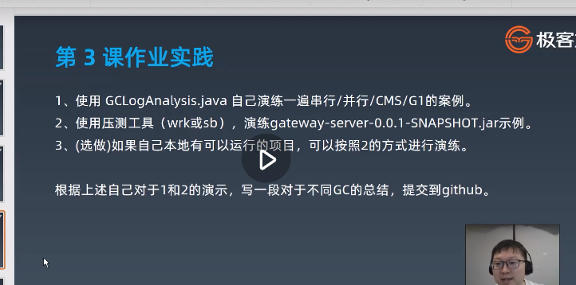

# Week02 作业题目




**Week02 作业题目（周四）：**

**1.**使用 GCLogAnalysis.java 自己演练一遍串行 / 并行 /CMS/G1 的案例。

**2.**使用压测工具（wrk 或 sb），演练 gateway-server-0.0.1-SNAPSHOT.jar 示例。

**3.（选做）** 如果自己本地有可以运行的项目，可以按照 2 的方式进行演练。
**4.（必做）** 根据上述自己对于 1 和 2 的演示，写一段对于不同 GC 的总结，提交到 Github。

**Week02 作业题目（周六）：**

**1.（选做）**运行课上的例子，以及 Netty 的例子，分析相关现象。
**2.（必做）**写一段代码，使用 HttpClient 或 OkHttp 访问 [http://localhost:8801 ](http://localhost:8801/)，代码提交到 Github。

以上作业，要求 2 道必做题目提交到 Github 上面，Week02 作业提交地址：
https://github.com/JAVA-000/JAVA-000/issues/113

请务必按照示例格式进行提交，不要复制其他同学的格式，以免格式错误无法抓取作业。
作业提交截止时间 10 月 28 日（下周三）23:59 前。

Github 使用教程：[ https://u.geekbang.org/lesson/51?article=294701](https://u.geekbang.org/lesson/51?article=294701)

学号查询方式：PC 端登录 time.geekbang.org, 点击右上角头像进入我的教室，左侧头像下方 G 开头的为学号


# 垃圾收集器的分类

+ **串行**垃圾收集器： 
  + ‐XX:+UseSerialGC 

+ **并行**垃圾收集器：
  +  `‐XX:+UseParallelGC` 
  + `‐XX:+UseParallelGC` 
  + `‐ XX:+UseParallelOldGC` 是等价的, 可以通过GC日志文件中的flags看出来。 

+ **CMS**垃圾收集器： 
  + `‐XX:+UseConcMarkSweepGC `
  + `‐XX:+UseParNewGC` 
  + `‐XX:+UseConcMarkSweepGC` 是等价的。 
  + 但如果只指定 ‐XX:+UseParNewGC 参数则老年代GC会使用SerialGC。使用CMS时，命令行参数中会自动计算出年轻代、老年代的初始值和最大值，以及最大晋升阈值等信息（例如 ‐ XX:MaxNewSize=178958336 ‐XX:NewSize=178958336 ‐ XX:OldSize=357912576 ）。 

+ **G1**垃圾收集器：
  +  `‐XX:+UseG1GC` 。
  + 原则上不能指定G1垃圾收集器的年轻代


**其他参数** 

JVM里还有一些GC日志相关的参数， 例如： 

‐XX:+PrintGCApplicationStoppedTime 可以输出每次GC的持续时间和程序 

暂停时间； 

‐XX:+PrintReferenceGC 输出GC清理了多少引用类型。 

这里就不在累述，想了解配置详情的，可以回头复习前面的章节。 

> **说明**：大部分情况下，配置GC参数并不是越多越好。原则上只配置最重要的几个参数即可，其他的都保持默认值，除非你对系统的业务特征有了深入的分析和了解，才需要进行某些细微参数的调整。 毕竟，古语有云：“过早优化是万恶之源”。


# GC日志分析可执行代码


```java


​```java
import java.util.Random;
import java.util.concurrent.TimeUnit;
import java.util.concurrent.atomic.LongAdder;

/*
演示GC日志生成与解读
*/
public class GCLogAnalysis {
    private static Random random = new Random();

    public static void main(String[] args) {
// 当前毫秒时间戳
        long startMillis = System.currentTimeMillis();
// 持续运行毫秒数; 可根据需要进行修改
        long timeoutMillis = TimeUnit.SECONDS.toMillis(1);
// 结束时间戳
        long endMillis = startMillis + timeoutMillis;
        LongAdder counter = new LongAdder();
        System.out.println("正在执行...");
// 缓存一部分对象; 进入老年代
        int cacheSize = 2000;
        Object[] cachedGarbage = new Object[cacheSize];
// 在此时间范围内,持续循环
        while (System.currentTimeMillis() < endMillis) {
// 生成垃圾对象
            Object garbage = generateGarbage(100 * 1024);
            counter.increment();
            int randomIndex = random.nextInt(2 * cacheSize);
            if (randomIndex < cacheSize) {
                cachedGarbage[randomIndex] = garbage;
            }
        }
        System.out.println("执行结束!共生成对象次数:" + counter.longValue());
    }

    // 生成对象
    private static Object generateGarbage(int max) {
        int randomSize = random.nextInt(max);
        int type = randomSize % 4;
        Object result = null;
        switch (type) {
            case 0:
                result = new int[randomSize];
                break;
            case 1:
                result = new byte[randomSize];
                break;
            case 2:
                result = new double[randomSize];
                break;
            default:
                StringBuilder builder = new StringBuilder();
                String randomString = "randomString‐Anything";
                while (builder.length() < randomSize) {
                    builder.append(randomString);
                    builder.append(max);
                    builder.append(randomSize);
                }
                result = builder.toString();
                break;
        }
        return result;
    }
}

​```


```


# 分析总结


Serial GC（串行）日志分析

```shell
 java ‐XX:+UseSerialGC  ‐Xms512m ‐Xmx512m ‐Xloggc:gc.demo.log  ‐XX:+PrintGCDetails ‐XX:+PrintGCDateStamps GCLogAnalysis
```


目录中会生成一个gc.demo.log的文件，内容如下：

```java
Java HotSpot(TM) 64-Bit Server VM (25.261-b12) for windows-amd64 JRE (1.8.0_261-b12), built on Jun 18 2020 06:56:32 by "" with unknown MS VC++:1916
    
Memory: 4k page, physical 15665804k(6790128k free), swap 28773004k(14014808k free)
    
CommandLine flags: -XX:InitialHeapSize=4294967296 -XX:MaxHeapSize=10737418240 -XX:+PrintGC -XX:+PrintGCDateStamps -XX:+PrintGCDetails -XX:+PrintGCTimeStamps -XX:+UseCompressedClassPointers -XX:+UseCompressedOops -XX:-UseLargePagesIndividualAllocation -XX:+UseSerialGC 
    
2020-10-24T09:06:35.873+0800: 0.659: [GC (Allocation Failure) 2020-10-24T09:06:35.873+0800: 0.659: [DefNew: 1118528K->139776K(1258304K), 0.1029829 secs] 1118528K->239842K(4054528K), 0.1032964 secs] [Times: user=0.08 sys=0.03, real=0.10 secs] 

2020-10-24T09:06:36.189+0800: 0.976: [GC (Allocation Failure) 2020-10-24T09:06:36.189+0800: 0.976: [DefNew: 1258304K->139775K(1258304K), 0.1093226 secs] 1358370K->388856K(4054528K), 0.1094380 secs] [Times: user=0.05 sys=0.06, real=0.11 secs] 

Heap
 def new generation   total 1258304K, used 364522K [0x0000000540000000, 0x0000000595550000, 0x0000000615550000)
  eden space 1118528K,  20% used [0x0000000540000000, 0x000000054db7ab88, 0x0000000584450000)
  from space 139776K,  99% used [0x0000000584450000, 0x000000058cccfff0, 0x000000058ccd0000)
  to   space 139776K,   0% used [0x000000058ccd0000, 0x000000058ccd0000, 0x0000000595550000)
 tenured generation   total 2796224K, used 249080K [0x0000000615550000, 0x00000006c0000000, 0x00000007c0000000)
   the space 2796224K,   8% used [0x0000000615550000, 0x000000062488e178, 0x000000062488e200, 0x00000006c0000000)
 Metaspace       used 2623K, capacity 4486K, committed 4864K, reserved 1056768K
  class space    used 288K, capacity 386K, committed 512K, reserved 1048576K
```


分析1：

```java
Java HotSpot(TM) 64-Bit Server VM (25.261-b12) for windows-amd64 JRE (1.8.0_261-b12), built on Jun 18 2020 06:56:32 by "" with unknown MS VC++:1916
```

以上展示的是JVM的版本信息等；


分析2：

```java
Memory: 4k page, physical 15665804k(6790128k free), swap 28773004k(14014808k free)
```

> 以上内容，展示了内存分页、物理内存大小，交换内存大小等参数


分析3：

```java
CommandLine flags: -XX:InitialHeapSize=4294967296 -XX:MaxHeapSize=10737418240 -XX:+PrintGC -XX:+PrintGCDateStamps -XX:+PrintGCDetails -XX:+PrintGCTimeStamps -XX:+UseCompressedClassPointers -XX:+UseCompressedOops -XX:-UseLargePagesIndividualAllocation -XX:+UseSerialGC 
```

> 以上内容展示了本次JVM启动时的参数；
>
> 例如：
>
> -XX:InitialHeapSize=4294967296 ：是我电脑的初始化的堆内存大小；
>
>  -XX:MaxHeapSize=10737418240：是最大的堆内存大小；
>
>  -XX:+PrintGC：启用每个GC上打印消息的功能，默认是禁止的；
>
>  -XX:+PrintGCDateStamps：允许在每个GC上打印时间戳，默认是禁止的；
>
>  -XX:+PrintGCDetails：打印GC详细信息；
>
>  -XX:+PrintGCTimeStamps：启用每个GC上打印时间戳的功能，默认禁止；
>
>  -XX:+UseSerialGC：启用串行垃圾收集器；


以上参数都可以通过：

https://docs.oracle.com/javase/8/docs/technotes/tools/unix/java.html

查找的到。


分析3：

```java
2020-10-24T09:06:35.873+0800: 0.659: [GC (Allocation Failure) 2020-10-24T09:06:35.873+0800: 0.659: [DefNew: 1118528K->139776K(1258304K), 0.1029829 secs] 1118528K->239842K(4054528K), 0.1032964 secs] [Times: user=0.08 sys=0.03, real=0.10 secs] 

2020-10-24T09:06:36.189+0800: 0.976: [GC (Allocation Failure) 2020-10-24T09:06:36.189+0800: 0.976: [DefNew: 1258304K->139775K(1258304K), 0.1093226 secs] 1358370K->388856K(4054528K), 0.1094380 secs] [Times: user=0.05 sys=0.06, real=0.11 secs]
```

> 上面这是发生了两次GC，就是运行这个程序的时候，JVM自动垃圾回收了2次。


从中可以解读出这些信息：

> 1、2020-10-24T09:06:35.873+0800: 0.659  ：GC时间开始的时间点。其中`+0800`是时区的意思，表示当前时区为东八区。这只是一个标识，方便我们直观判断GC发生的时间点。后面的0.659是GC事件对于JVM启动时间的间隔，单位是秒。
>
> 2、`GC` ：是用来区分Minor GC还是Full GC的标志。`GC`表明这是一次**小型GC(Minor GC)**，既年轻代GC。`Allocation Failure`表示触发GC的原因。
>
> 本次GC事件，是由于对象分配失败，年轻代中没有空间来存放新生成的对象引起的。
>
> 3、`DefNew`：表示垃圾收集器的名称。这个名字表示年轻代使用的单线程、标记-复制、STW垃圾收集器。
>
> `1118528K->139776K(1258304K)`中`1118528K->139776K`：指的是在垃圾收集之前和之后整个堆内存的使用情况。`(1258304K)`表示年轻代的总空间容量大小。
>
> 通过分析可知：GC之前年轻代`使用率=（GC之前的容量 ÷ 总容量）`。
>
> 那么第一次GC之前的使用率就是：1118528÷1258304=88%，`88%`说明了第一次GC之前的使用率是88%。
>
> GC之后的使用率：139776 ÷ 1258304 = 1%，可以看到回收效果还是很强的，说明回收垃圾之后还剩下1%的容量正在使用。
>
> 4、`1118528K->239842K(4054528K)`表示在垃圾收集之前和之后整个堆内存的使用情况。
>
> `(4054528K)`是表示堆内存可用的总空间大小。
>
> 近一步分析可知：
>
> + 本次GC之后的堆内存使用率为：0.5%（239842   ÷   4054528 ）
>
> + 本次GC之前的堆内存使用率为：27%
>
>  5、`0.1032964 secs`：本次GC事件持续的时间，以秒为单位；
>
>  6、`[Times: user=0.08 sys=0.03, real=0.10 secs] `：本次GC事件的持续时间，分别通过三个部分来衡量：
>
> `user`：表示所有GC线程消耗的CPU时间；
>
> `sys`：表示系统调用和系统等待事件消耗的时间；
>
> `real`：表示应用程序暂停的时间。
>
> 因为串行垃圾收集器（Serial Garbage Collector）只使用单个线程，所以这里`real = user + sys`。


其他的类似


# 第二个作业

只写了一个get请求的。

```java
package com.job1;

import org.apache.http.HttpEntity;
import org.apache.http.client.methods.CloseableHttpResponse;
import org.apache.http.client.methods.HttpGet;
import org.apache.http.impl.client.CloseableHttpClient;
import org.apache.http.impl.client.HttpClientBuilder;
import org.apache.http.util.EntityUtils;

import java.io.IOException;

/**
 * @program: javaproject
 * @description:
 * @author: zhengh
 * @create: 2020-10-26 20:53
 **/
public class TestHttpClient {

    public static void main(String[] args) {
        String type = "get";
        String url = "http://127.0.0.1:8801";
        String parem = null;

        send(url,parem,type);


    }

    /**
     *
     * @param url
     * @param parem
     */
    public static void send(String url,String parem,String type){

        //获得一个http客户端
        CloseableHttpClient httpClient = HttpClientBuilder.create().build();

        //创建get请求
        HttpGet httpGet = new HttpGet(url);

        //响应模型
        CloseableHttpResponse response = null;

        try {
            //客户端-----(发送Get请求)----->目标url
            response = httpClient.execute(httpGet);

            //从相应模型中获取响应实体
            HttpEntity responseEntity = response.getEntity();

            System.out.println("响应状态为："+response.getStatusLine());

            if(responseEntity != null){

                System.out.println("响应内容长度为："+responseEntity.getContentLength());
                System.out.println("响应内容为："+ EntityUtils.toString(responseEntity));

            }

        } catch (IOException e) {
            System.out.println("发送请求失败，失败原因："+e.getMessage());
        }finally {
            try {
                //释放资源
                if (httpClient != null){
                    httpClient.close();
                }
                if(response != null) {
                    response.close();
                }
            } catch (IOException e) {
                e.printStackTrace();
            }
        }
    }


}


```


**测试结果：**
```java
21:14:09.890 [main] DEBUG org.apache.http.client.protocol.RequestAddCookies - CookieSpec selected: default
21:14:09.906 [main] DEBUG org.apache.http.client.protocol.RequestAuthCache - Auth cache not set in the context
21:14:09.908 [main] DEBUG org.apache.http.impl.conn.PoolingHttpClientConnectionManager - Connection request: [route: {}->http://127.0.0.1:8801][total available: 0; route allocated: 0 of 2; total allocated: 0 of 20]
21:14:09.927 [main] DEBUG org.apache.http.impl.conn.PoolingHttpClientConnectionManager - Connection leased: [id: 0][route: {}->http://127.0.0.1:8801][total available: 0; route allocated: 1 of 2; total allocated: 1 of 20]
21:14:09.930 [main] DEBUG org.apache.http.impl.execchain.MainClientExec - Opening connection {}->http://127.0.0.1:8801
21:14:09.933 [main] DEBUG org.apache.http.impl.conn.DefaultHttpClientConnectionOperator - Connecting to /127.0.0.1:8801
21:14:09.935 [main] DEBUG org.apache.http.impl.conn.DefaultHttpClientConnectionOperator - Connection established 127.0.0.1:54589<->127.0.0.1:8801
21:14:09.935 [main] DEBUG org.apache.http.impl.execchain.MainClientExec - Executing request GET / HTTP/1.1
21:14:09.935 [main] DEBUG org.apache.http.impl.execchain.MainClientExec - Target auth state: UNCHALLENGED
21:14:09.936 [main] DEBUG org.apache.http.impl.execchain.MainClientExec - Proxy auth state: UNCHALLENGED
21:14:09.938 [main] DEBUG org.apache.http.headers - http-outgoing-0 >> GET / HTTP/1.1
21:14:09.938 [main] DEBUG org.apache.http.headers - http-outgoing-0 >> Host: 127.0.0.1:8801
21:14:09.938 [main] DEBUG org.apache.http.headers - http-outgoing-0 >> Connection: Keep-Alive
21:14:09.938 [main] DEBUG org.apache.http.headers - http-outgoing-0 >> User-Agent: Apache-HttpClient/4.5.12 (Java/1.8.0_261)
21:14:09.938 [main] DEBUG org.apache.http.headers - http-outgoing-0 >> Accept-Encoding: gzip,deflate
21:14:09.939 [main] DEBUG org.apache.http.wire - http-outgoing-0 >> "GET / HTTP/1.1[\r][\n]"
21:14:09.939 [main] DEBUG org.apache.http.wire - http-outgoing-0 >> "Host: 127.0.0.1:8801[\r][\n]"
21:14:09.939 [main] DEBUG org.apache.http.wire - http-outgoing-0 >> "Connection: Keep-Alive[\r][\n]"
21:14:09.939 [main] DEBUG org.apache.http.wire - http-outgoing-0 >> "User-Agent: Apache-HttpClient/4.5.12 (Java/1.8.0_261)[\r][\n]"
21:14:09.939 [main] DEBUG org.apache.http.wire - http-outgoing-0 >> "Accept-Encoding: gzip,deflate[\r][\n]"
21:14:09.939 [main] DEBUG org.apache.http.wire - http-outgoing-0 >> "[\r][\n]"
21:14:09.955 [main] DEBUG org.apache.http.wire - http-outgoing-0 << "HTTP/1.1 200 OK[\r][\n]"
21:14:09.958 [main] DEBUG org.apache.http.wire - http-outgoing-0 << "Content-Type:text/html;charset=utf-8[\r][\n]"
21:14:09.958 [main] DEBUG org.apache.http.wire - http-outgoing-0 << "[\r][\n]"
21:14:09.958 [main] DEBUG org.apache.http.wire - http-outgoing-0 << "hello,nio"
21:14:09.959 [main] DEBUG org.apache.http.headers - http-outgoing-0 << HTTP/1.1 200 OK
21:14:09.959 [main] DEBUG org.apache.http.headers - http-outgoing-0 << Content-Type:text/html;charset=utf-8
响应状态为：HTTP/1.1 200 OK
响应内容长度为：-1
21:14:09.972 [main] DEBUG org.apache.http.wire - http-outgoing-0 << "end of stream"
21:14:09.972 [main] DEBUG org.apache.http.impl.conn.DefaultManagedHttpClientConnection - http-outgoing-0: Close connection
21:14:09.972 [main] DEBUG org.apache.http.impl.execchain.MainClientExec - Connection discarded
21:14:09.973 [main] DEBUG org.apache.http.impl.conn.PoolingHttpClientConnectionManager - Connection released: [id: 0][route: {}->http://127.0.0.1:8801][total available: 0; route allocated: 0 of 2; total allocated: 0 of 20]
响应内容为：hello,nio
21:14:09.973 [main] DEBUG org.apache.http.impl.conn.PoolingHttpClientConnectionManager - Connection manager is shutting down
21:14:09.973 [main] DEBUG org.apache.http.impl.conn.PoolingHttpClientConnectionManager - Connection manager shut down

Process finished with exit code 0

```


